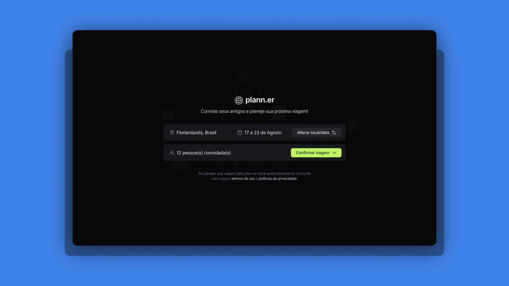

# Plann.er | Project of NLW Journey
[](#)

With the **Plann.er**, you can create travel plans, invite friends and write down activities to perform during the trip!

> Status: Finished... ✅

## Technologies 🚀


## Libs 📕

📑 **TSX**

📑 **DAYJS**

📑 **DOTENVT**

📑 **NODEMAILER**

## Features 💡

✅ **CREATE TRIP**

✅ **INVITE FRIENDS TO TRIP**

✅ **CREATE ACTIVITIES TO TRIP**

## How do use the project ⚙️

### Frontend

#### 1. Clone the repository
```sh
git clone https://github.com/reinheimermat/planner-web
```
#### 2. install dependencies
```sh
pnpm install
```
#### 3. Run local project
```sh
pnpm run dev
```
#### 4. Access the project
```sh
http://localhost:5173/
```
### Backend

#### 1. Clone the repository
```sh
git clone https://github.com/reinheimermat/planner-api
```
### 2. Config envoriments
Rename the file **.env.example** to **.env**

### 3. Install dependencies
```sh
pnpm run dev
```
### 4. Run create database with Prisma
```sh
npx prisma generate 
```

### 5. Run the project
```sh
pnpm run dev
```

## Links 🔗

[](https://www.figma.com/community/file/1392276515495389646)

## License 📝

[](https://github.com/Ileriayo/markdown-badges/blob/master/LICENSE)